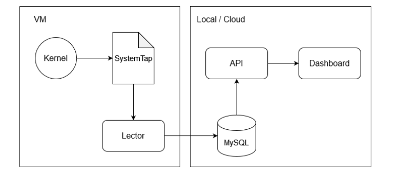

# Laboratorio Sistemas Operativos 2 - Proyecto 

**Miembros del grupo #22**

| Nombre                            | Carnet    |
| --------------------------------- | --------- |
| Bryan Alexander Portillo Alvarado | 201602880 |
| Pablo Andres Axpuac Arevalo       | 201900096 |

### Descripcion

El manejo eficiente de la memoria es un aspecto crucial en el rendimiento y la estabilidad de cualquier sistema operativo. En el entorno de Linux, entender cómo se asigna y libera la memoria por parte de los procesos es fundamental para optimizar el uso de los recursos del sistema y garantizar su buen funcionamiento bajo diversas cargas de trabajo.

El proyecto "Manejo de Memoria" se enfoca en desarrollar una aplicación capaz de monitorear el uso de memoria de cada proceso abierto en un sistema Linux. Esta aplicación proporciona a los usuarios una herramienta valiosa para entender cómo interactúan los procesos con el sistema operativo en términos de asignación y liberación de memoria, así como para identificar posibles cuellos de botella y optimizar la asignación de recursos.

Este manual técnico tiene como objetivo proporcionar una guía completa para entender, configurar y utilizar la aplicación desarrollada. Se describen los componentes principales de la aplicación, las funcionalidades que ofrece y las instrucciones paso a paso para su instalación y uso.

### Arquitectura

### memory_request.stp
Este script SystemTap (memory_request.stp) está diseñado para monitorear las llamadas al sistema mmap2 y munmap en un sistema Linux. Estas llamadas están relacionadas con la asignación y liberación de memoria por parte de los procesos del sistema operativo. El script registra información como el PID del proceso, el nombre del proceso, la fecha y hora de la solicitud, así como el tamaño del segmento de memoria involucrado en la llamada.

* Este script captura las llamadas al sistema mmap2, que se utilizan para asignar un nuevo segmento de memoria virtual en el espacio de direcciones de un proceso.

* Registra información sobre el proceso que realiza la llamada, como el PID, el nombre del proceso, la fecha y hora de la solicitud, y el tamaño del segmento de memoria. Manejo de llamadas al sistema munmap:

* El script también intercepta las llamadas al sistema munmap, que se utilizan para liberar un segmento de memoria previamente asignado.
Registra información similar a las llamadas al sistema mmap2.

### Estructura del código:

*Encabezado y declaración global:*

El script comienza con el shebang (#!) que indica la ubicación del intérprete de SystemTap.
Se declara una variable global last_call para almacenar la última llamada registrada, evitando duplicados. 

*Manejadores de llamadas al sistema:*

* probe syscall.mmap2: Maneja las llamadas al sistema mmap2, formatea la información relevante y la imprime si es diferente de la última llamada registrada.
* probe syscall.munmap: Maneja las llamadas al sistema munmap, similar a mmap2.

### main.c:

El archivo main.c es un programa en lenguaje C que se encarga de conectar con una base de datos MySQL, ejecutar un script SystemTap para monitorear las llamadas al sistema relacionadas con el manejo de memoria en Linux, procesar la salida de dicho script y almacenar la información en la base de datos.

#### *Funcionalidad:*

*Conexión a la base de datos MySQL:*

El programa se conecta a una base de datos MySQL utilizando la biblioteca libmysqlclient.
Se establecen los parámetros de conexión como la dirección del servidor, el nombre de usuario, la contraseña y el nombre de la base de datos.

*Ejecución del script SystemTap:*

Utiliza popen para ejecutar el script SystemTap memory_requests.stp con privilegios de superusuario (sudo).
El script monitorea las llamadas al sistema mmap2 y munmap, capturando información sobre el PID del proceso, el nombre del proceso, la fecha y hora de la solicitud, y el tamaño del segmento de memoria involucrado.

*Procesamiento de la salida del script SystemTap:*

Lee la salida del script línea por línea utilizando fgets.
Divide cada línea en tokens utilizando la coma como delimitador.
Extrae la información relevante, como el tipo de llamada, el PID del proceso, el nombre del proceso, la fecha y hora de la solicitud, y el tamaño del segmento de memoria.

*Almacenamiento en la base de datos:*

Utiliza la biblioteca MySQL para ejecutar consultas SQL e insertar la información obtenida en la base de datos.
Crea una consulta SQL dinámica utilizando la información procesada y la ejecuta con mysql_query.

